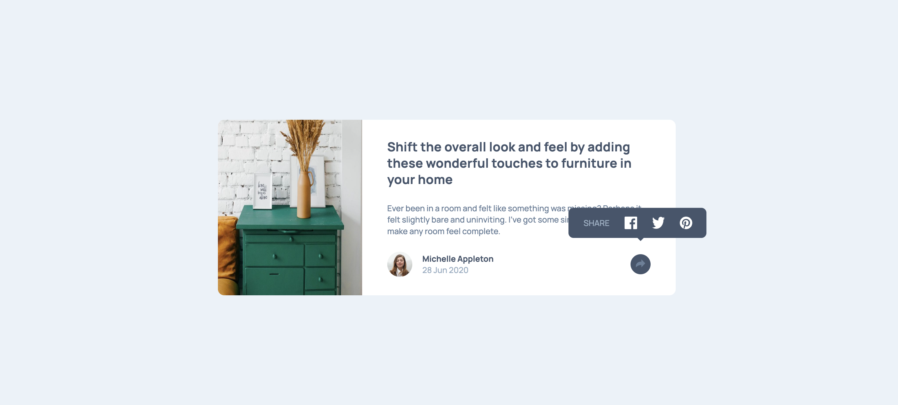

# Frontend Mentor - Article preview component solution

This is a solution to the [Article preview component challenge on Frontend Mentor](https://www.frontendmentor.io/challenges/article-preview-component-dYBN_pYFT). Frontend Mentor challenges help you improve your coding skills by building realistic projects.

## Table of contents

- [Frontend Mentor - Article preview component solution](#frontend-mentor---article-preview-component-solution)
  - [Table of contents](#table-of-contents)
  - [Overview](#overview)
    - [The challenge](#the-challenge)
    - [Screenshot](#screenshot)
    - [Links](#links)
  - [My process](#my-process)
    - [Built with](#built-with)
    - [What I learned](#what-i-learned)
    - [Continued development](#continued-development)
    - [Useful resources](#useful-resources)
  - [Author](#author)

**Note: Delete this note and update the table of contents based on what sections you keep.**

## Overview

### The challenge

Users should be able to:

-   View the optimal layout for the component depending on their device's screen size
-   See the social media share links when they click the share icon

### Screenshot

### Links

-   Solution URL: [https://github.com/EmLopezDev/Article-Preview-Component](https://github.com/EmLopezDev/Article-Preview-Component)
-   Live Site URL: [https://emlopezdev.github.io/Article-Preview-Component/](https://emlopezdev.github.io/Article-Preview-Component/)

## My process

### Built with

-   Semantic HTML5 markup
-   SCSS variables, functions, and mixins
-   Flexbox
-   Mobile-first workflow
-   Javascript

### What I learned

-   How to create a tooltip/toast with CSS.
-   About the defer property in the scrip tag.

### Continued development

-   I want to find a better solution to creating a toast, where it is more responsive on its own instead of relying on media query.
-   I also want to start creating my own library of reusable components like buttons and tooltips, maybe create a library and use npm to add it to each project.

### Useful resources

-   [How to create a tooltip](https://levelup.gitconnected.com/how-to-build-a-css-only-tooltip-that-actually-works-69cb7b1b3c4a) - simple guide on creating a tool tip.

## Author

-   Frontend Mentor - [@EmLopezDev](https://www.frontendmentor.io/profile/EmLopezDev)
